# 融合弛豫电压多尺度特征的锂电池剩余寿命预测

本仓库基于 Zhu et al. (2022) 公开数据集，实现**论文复现**与两项研究内容：

| 模块 | 目录 | 内容 |
|------|------|------|
| 论文复现 | `battery_pipeline/` | 统计特征 + SVR/XGBoost/TL2 |
| **研究内容一** | `research_mae/` | Hybrid Dilated MS-CNN MAE + 门控融合 → 退化特征 `.npy` |
| **研究内容二** | `research_rul/` | Quantile TCN + Pinball/单调惩罚 + 区间校准 → RUL |

```
研究内容一（特征）  →  融合特征 .npy
        ↓
研究内容二（RUL）  →  Quantile TCN 预测剩余寿命 + 不确定性区间
```

原始实验数据：[Zenodo 10.5281/zenodo.6405084](https://doi.org/10.5281/zenodo.6405084)

---

## 项目结构

```
.
├── Dataset_{1,2,3}_*/          # 原始循环 CSV（需自行下载）
├── battery_pipeline/           # 论文复现
├── research_mae/               # 研究内容一
│   ├── run_all.py              # MAE + 融合 + 特征导出 + Fig 1–5
│   ├── thesis_figures.py       # 论文规格图表
│   ├── models.py               # Hybrid Dilated MS-CNN MAE + 门控融合
│   ├── cc_filter.py            # D1 CC 突变剔除
│   ├── features/               # dataset_*_fused.npy
│   ├── figures/                # Fig 1–5、Fig 10
│   └── RESEARCH_CONTENT_1.md   # 详细说明
├── research_rul/               # 研究内容二
│   ├── run_all.py              # Quantile TCN + Fig 6–9
│   ├── quantile_tcn.py         # 掩码注意力 Quantile TCN
│   ├── figures/                # Fig 6–9
│   └── RESEARCH_CONTENT_2.md   # 详细说明
├── run_research.py             # 研究内容一 + 二 一键运行
├── run_pipeline.py             # 论文复现入口
├── run_figures.py              # 论文图表
├── environment.yml
└── requirements.txt
```

---

## 环境配置

```bash
conda env create -f environment.yml
conda activate battery-capacity
# 或：pip install -r requirements.txt
```

主要依赖：`numpy`、`pandas`、`scikit-learn`、`torch`、`matplotlib`、`scipy`。

**GPU 提示**：驱动最高支持 CUDA 12.8 时，请安装匹配的 PyTorch（如 `cu128`），而不是 `cu130`。训练前建议：

```bash
conda activate battery-capacity
export LD_LIBRARY_PATH="$CONDA_PREFIX/lib:${LD_LIBRARY_PATH:-}"
python research_mae/run_all.py --device cuda
```

---

## 一键运行（研究内容一 + 二）

```bash
conda activate battery-capacity
cd /path/to/data-driven-capacity-estimation-from-voltage-relaxation

# 完整流程：数据缓存 → MAE → 融合 → 特征导出 → RUL 训练 → 全部图表
python run_research.py --rebuild-data --device cuda   # 或 cpu
```

分步运行：

```bash
# 仅研究内容一（5-seed 融合集成）
python research_mae/run_all.py --device cuda --fusion-seeds 42,43,44,45,46

# 仅研究内容二（需先完成特征导出；含 3-seed RUL 集成）
python research_rul/run_all.py --device cuda

# 仅重新出 Fig 6–9
python research_rul/run_all.py --figures-only --device cuda
```

---

## 研究内容一：退化特征提取

### 方法

```
原始 CSV
  → 满充后弛豫 ΔV 序列（D1/D2: 32 点，D3: 64 点）
  → Hybrid Dilated MS-CNN MAE
       · 并行分支：kernel 3/5/7 + dilation 2/4 + 残差
       · 30% 连续块掩码；掩码区主导重构损失
       · Avg+Max 双池化 → 32 维隐向量
  → 门控通道融合 [弛豫隐向量, CC 充电时间]
  → 融合特征 f → 导出 .npy（模块解耦）
```

**Dataset 1 特殊处理**：`cc_filter.py` 对 CC 充电时间做 rolling-median 突变检测，剔除异常段（约 129 圈）。

### 定量结果（Strategy D 留出电芯，容量回归验证特征质量）

| 方法 | Test RMSE% | R² |
|------|------------|-----|
| **D1 集成（5 seeds）** | **0.43%** | 0.995 |
| D1 单模型 | 0.50% | 0.993 |
| Latent Ridge | 2.65% | 0.800 |
| 论文 SVR 基线 | ~1.02% | — |
| D2 原生留出 | **0.23%** | 0.998 |
| D3 原生留出 | **0.60%** | 0.996 |

### 图表（Fig 1–5、Fig 10）

#### Fig 1 — 弛豫电压（Dataset 1，每隔 20 圈一条，蓝→红渐变）

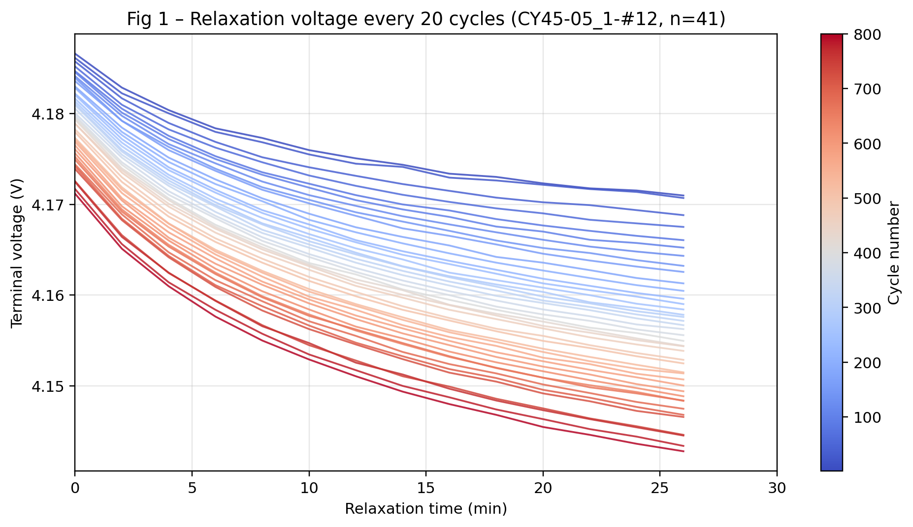

#### Fig 2 — 三数据集 CC 充电时间对比（a/b/c）

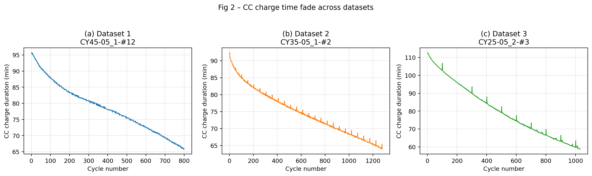

#### Fig 3 — Hybrid Dilated MS-CNN MAE 重构（**30% 连续块掩码**）

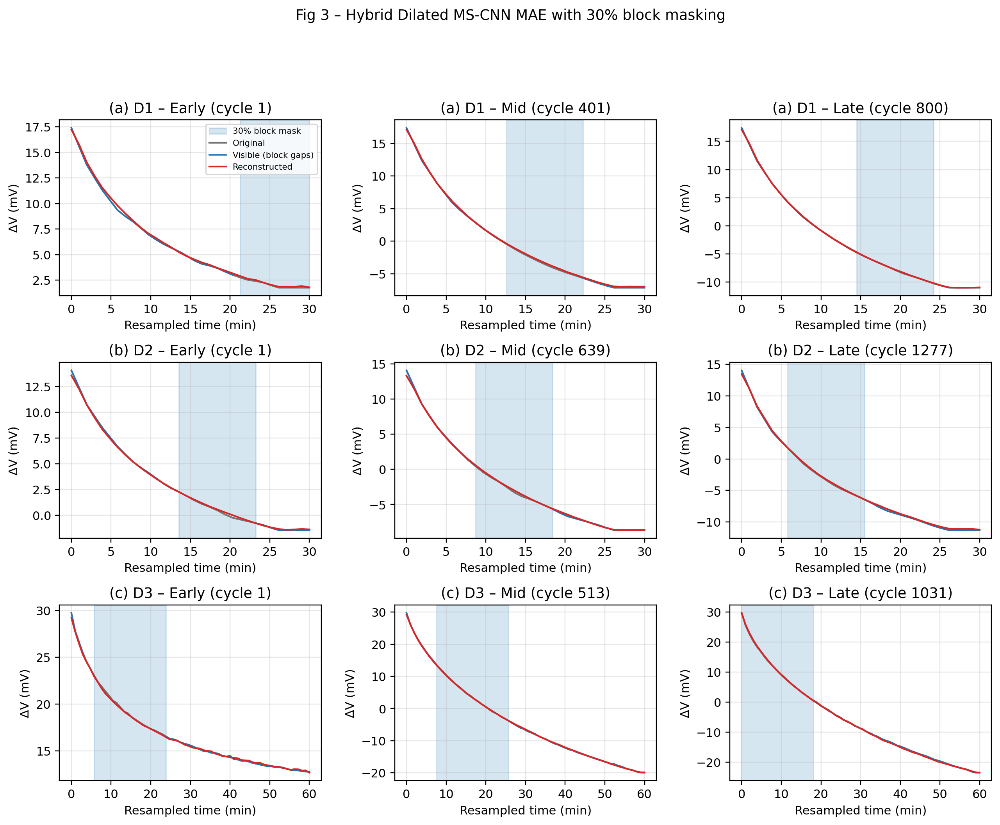

#### Fig 4 — 隐向量老化流形（t-SNE，分数据集 + Spearman）

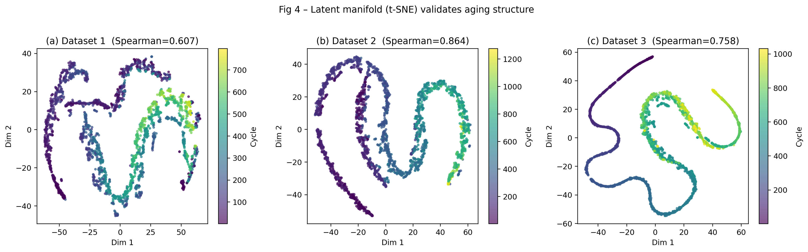

#### Fig 5 — 通道注意力权重 vs 归一化寿命比率

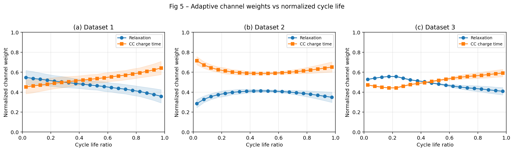

#### Fig 10 — NCA @ 45°C、0.5C 整圈协议曲线（CC→CV→静置→放电）

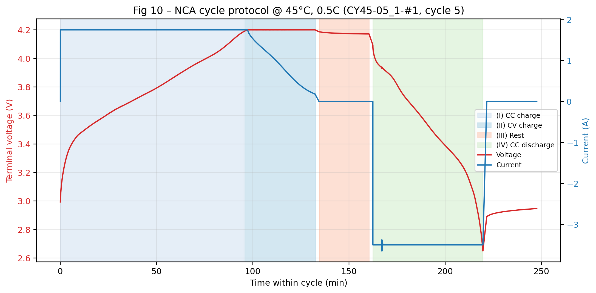

详细说明：[research_mae/RESEARCH_CONTENT_1.md](research_mae/RESEARCH_CONTENT_1.md)

---

## 研究内容二：RUL 预测 + 不确定性量化

### 方法

```
融合特征序列 [f_1, …, f_i]（可选因果 SOH 辅助特征）
  → Quantile TCN（因果卷积 + 掩码注意力池化，5%/50%/95%）
  → 加权 Pinball Loss + 单调递减物理惩罚 + 晚期寿命加权 L1
  → 验证集 conformal 区间校准
  → 多 seed 集成 → RUL 点预测 + 90% 置信区间
```

- **RUL 标签**：EOL = 80% 标称容量，RUL_i = N_EOL − cycle_i；删失电芯剔除
- **评估划分**：Dataset 1 Strategy D 留出 14 颗测试电芯
- **消融公平性**：SOH 辅助特征仅用于 fused / concat，单模态基线不使用

### 定量结果（Strategy D 测试集，3-seed 集成）

| 指标 | 数值 |
|------|------|
| **RMSE** | **21.2 圈** |
| **MAE** | 10.9 圈 |
| PICP (90%) | **0.95** |
| PINAW | 0.10 |

### 消融实验（Fig 7，单 seed）

| 特征输入 | RMSE (圈) | MAE (圈) |
|---------|-----------|----------|
| 仅弛豫 latent | 28.8 | 16.8 |
| 仅 CC | 23.8 | 13.4 |
| 拼接 concat | 28.3 | 15.4 |
| **融合 fused** | **24.4** | **12.7** |

主结果 fused **3-seed 集成 RMSE = 21.2**（优于各单 seed / 单模态）。

### 图表（Fig 6–9）

#### Fig 6 — 单调物理惩罚有效性（有/无约束 RUL 预测对比）

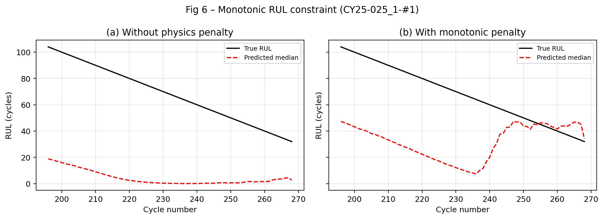

#### Fig 7 — 多特征融合消融（RMSE / MAE）

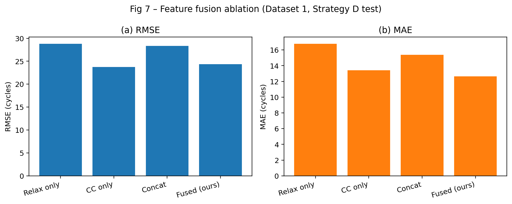

#### Fig 8 — 全寿命 RUL 预测与 90% 置信区间

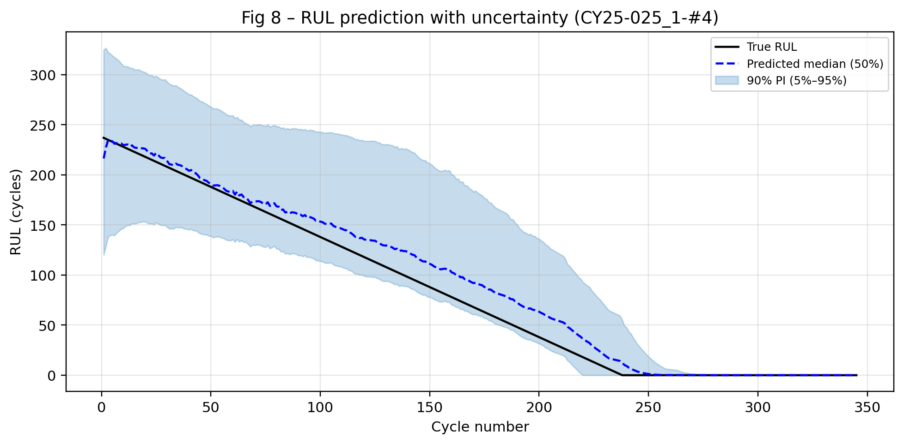

#### Fig 9 — 跨数据集零样本迁移（D1 训练 → D2 / D3）

| Dataset 2 (NCM) | Dataset 3 (NCM+NCA) |
|-----------------|---------------------|
| 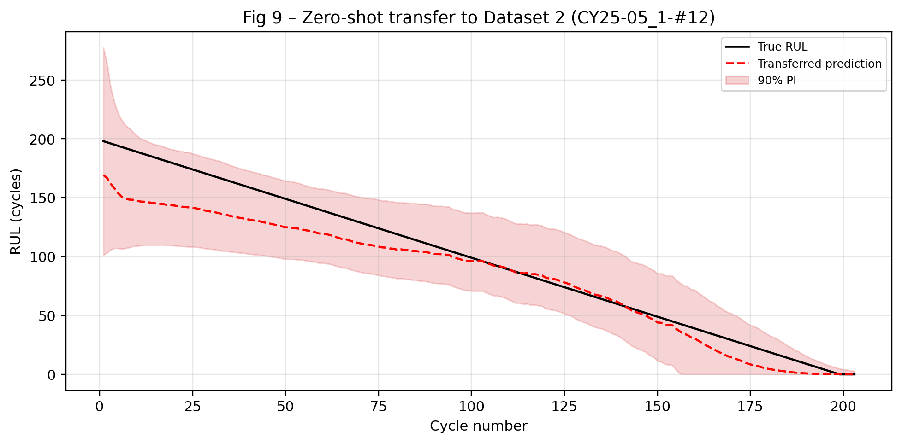 | 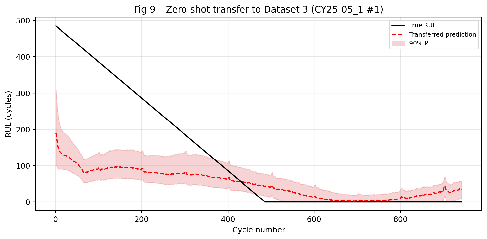 |

详细说明：[research_rul/RESEARCH_CONTENT_2.md](research_rul/RESEARCH_CONTENT_2.md)

---

## 论文复现（统计特征 + 经典 ML）

从满充后弛豫电压提取 `[Var, Ske, Max]`，用 ElasticNet / XGBoost / SVR 估计容量；Dataset 2/3 采用 TL2 迁移。

```bash
python run_pipeline.py --models-only
python run_figures.py --skip-training
```

| 模型 | D1 Test RMSE | 论文参考 |
|------|-------------|----------|
| XGBoost | 1.09% | 1.1% |
| SVR | 1.02% | 1.1% |

迁移 TL2：D2 4.14%，D3 5.41%（论文 TL2：1.7% / 1.6%）。

结果见 `output/results.json`。

---

## 与作者原始代码的关系

| 内容 | 作者提供 | 本仓库 |
|------|----------|--------|
| 原始循环 CSV | ✅ | 直接使用 |
| 弛豫电压段截取 | ✅ 部分脚本 | ✅ |
| 统计特征 + SVR/XGBoost | ❌ | ✅ `battery_pipeline/` |
| 迁移学习 TL2 | ❌ | ✅ |
| Hybrid Dilated MS-CNN MAE + 门控融合 | ❌ | ✅ `research_mae/` |
| Quantile TCN RUL 预测 | ❌ | ✅ `research_rul/` |

---

## 注意事项

1. **内存**：特征提取流式处理，正常运行 < 2 GB。
2. **PyTorch**：可用 `--device cuda`；若报 CUDA driver 过旧，请换用与驱动匹配的 wheel（如 cu128），并设置 `LD_LIBRARY_PATH=$CONDA_PREFIX/lib`。
3. **随机性**：Strategy D 划分固定 `random_state=42`；Fusion 集成 seeds `42–46`；RUL 集成 seeds `42–44`。
4. **数据重建**：序列维度变更或 CC 过滤更新后，需 `--rebuild-data` 重建缓存。

---

## 参考文献

Zhu, J., Wang, Y., Huang, Y. et al. Data-driven capacity estimation of commercial lithium-ion batteries from voltage relaxation. *Nat Commun* **13**, 2261 (2022). https://doi.org/10.1038/s41467-022-29837-w
