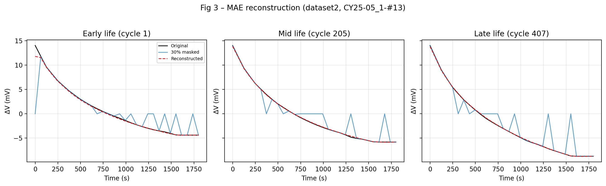
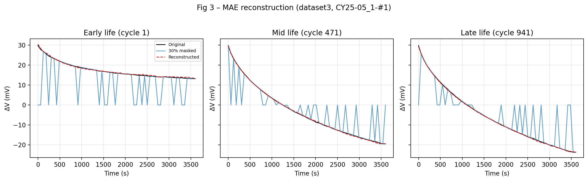

# ZYY——PART1

本仓库包含两条实现线：

1. **论文复现**（`battery_pipeline/`）：Zhu et al. (2022) [*Data-driven capacity estimation of commercial lithium-ion batteries from voltage relaxation*](https://doi.org/10.1038/s41467-022-29837-w) 的统计特征 + SVR/XGBoost/TL2 流水线
2. **研究内容一**（`research_mae/`）：弛豫序列掩码自编码器（MAE）+ 门控通道融合，用于容量回归与跨数据集迁移

原始仓库仅提供**部分特征截取脚本**与**原始实验数据**；建模与迁移学习代码需向作者索取。本实现在此基础上补全论文复现，并扩展深度学习方案。

原始实验数据：[Zenodo 10.5281/zenodo.6405084](https://doi.org/10.5281/zenodo.6405084)

---

## 项目结构

```
.
├── Dataset_{1,2,3}_*/               # 三个数据集原始循环 CSV
├── battery_pipeline/                # 论文复现（统计特征 + 经典 ML）
├── run_pipeline.py                  # 论文流水线入口
├── run_figures.py                   # 论文图表生成
├── research_mae/                    # 研究内容一（MAE + 门控融合）
│   ├── run_all.py                   # 一键运行
│   ├── figures/                     # 研究图表（见下文）
│   ├── IMPLEMENTATION.md            # 实现与 Debug 记录
│   └── PAPER_METHODS_RESULTS.md     # 论文方法 + 实验对照
├── output/                          # 论文复现输出（features、results.json、figures）
├── environment.yml
└── requirements.txt
```

---

## 研究内容一：MAE + 门控融合

### 方法概述

```
原始 CSV（电压/电流/容量）
    ↓ 截取满充后弛豫 ΔV，固定长度重采样
    ↓ 提取 CC 恒流充电时间
    ↓ MAE 编码器 → 32 维隐向量 z
    ↓ 门控融合（弛豫 z + CC 特征）→ 容量回归
    ↓ Strategy D 留出电芯评估 / 跨数据集迁移
```

- **ΔV 序列**：`V(t) − V(t₀)`，Dataset 1/2 为 30 点（30 min），Dataset 3 为 60 点（60 min）
- **CC 特征**：`log(CC/CC₀)` 与 z-score 双通道
- **融合模块**：Sigmoid 门控（替代易塌缩的 Softmax 注意力），两路权重可解释

运行方式：

```bash
conda activate battery-capacity
cd /path/to/data-driven-capacity-estimation-from-voltage-relaxation

# 完整流程
PYTHONUNBUFFERED=1 python research_mae/run_all.py --device cpu

# 复用 MAE checkpoint，仅重训 Fusion
python research_mae/run_all.py --skip-mae --device cpu
```

更多细节见 [`research_mae/README.md`](research_mae/README.md)、[`research_mae/FIGURES.md`](research_mae/FIGURES.md)（每张图的说明）、[`research_mae/IMPLEMENTATION.md`](research_mae/IMPLEMENTATION.md)。

### 定量结果（Strategy D 留出电芯）

| 方法 | Test RMSE% | R² |
|------|------------|-----|
| **D1 集成（3 seeds）** | **0.57%** | 0.99 |
| D1 单模型 | 0.75% | 0.98 |
| 论文复现 SVR（对照） | ~1.02% | — |
| D2 零样本 | 1.16% | 0.96 |
| D2 原生留出 | **0.36%** | 0.99 |
| D3 原生留出 | 0.94% | 0.99 |

详见 `research_mae/output/metrics.json`。

### 研究图表

#### Fig 1 — 弛豫 ΔV 曲线（第 10 / 300 / 600 圈）


#### Fig 2 — CC 充电时间随循环退化

| Dataset 1 (NCA) | Dataset 2 (NCM) |
|-----------------|-----------------|
|  |  |

#### Fig 3 — MAE 掩码重构（初 / 中 / 末期）






#### Fig 4 — 隐向量流形（t-SNE）

| 单电芯老化轨迹 | 全数据集 |
|----------------|----------|
|  |  |

#### Fig 5 — 门控融合权重随老化演变


#### Fig 6 — Strategy D 测试集容量预测


#### Fig 7 — 跨数据集迁移对比


#### 训练曲线


| MAE 短序列 | MAE 长序列 (D3) |
|------------|-----------------|
|  |  |

| Fusion D1 | Fusion D2 | Fusion D3 |
|-----------|-----------|-----------|
|  |  |  |

---

## 论文复现（统计特征 + 经典 ML）

### 方法概述

从**满充后弛豫电压曲线**提取统计特征 `[Var, Ske, Max]`，用 ElasticNet / XGBoost / SVR 估计归一化放电容量；Dataset 2/3 上采用 TL2 线性变换层做迁移微调。

```
原始 CSV → 截取弛豫电压段 → Var/Ske/Max → 归一化 → Dataset 1 训练
                                              ↓
                                    TL2 迁移至 Dataset 2/3
```

### 环境配置

```bash
conda env create -f environment.yml
conda activate battery-capacity
# 或：pip install -r requirements.txt
```

主要依赖：`numpy`、`pandas`、`scikit-learn`、`xgboost`、`scipy`；研究线另需 `torch`。

### 运行方式

```bash
# 特征已缓存：仅建模 + 迁移学习
PYTHONUNBUFFERED=1 BATTERY_SVR=cpu python run_pipeline.py --models-only

# 完整流程（特征提取 + 建模 + 迁移）
python run_pipeline.py

# 论文图表（输出至 output/figures/）
python run_figures.py --skip-training   # Fig 1–3，无需重训
python run_figures.py                   # 含 Fig 4、Fig 6
```

环境变量：`BATTERY_DEVICE=auto`（XGBoost）、`BATTERY_SVR=cpu`（SVR 后端）。

### 复现结果

**Dataset 1 基础模型（`random_state=42`，CPU SVR）**

| 模型 | 训练 RMSE | 测试 RMSE | 论文参考 |
|------|-----------|-----------|----------|
| ElasticNet | 2.16% | 1.88% | — |
| XGBoost | 0.55% | **1.09%** | 1.1% |
| SVR | 0.90% | **1.02%** | 1.1% |

**迁移学习 TL2 + SVR**

| 数据集 | Zero-shot | TL2 | 论文 TL2 |
|--------|-----------|-----|----------|
| Dataset 2 (NCM) | 6.38% | 4.14% | 1.7% |
| Dataset 3 (NCM+NCA) | 9.58% | 5.41% | 1.6% |

结果写入 `output/results.json`。实现细节（弛豫截取、Strategy D 划分、TL2 优化）见 [`research_mae/PAPER_METHODS_RESULTS.md`](research_mae/PAPER_METHODS_RESULTS.md)。

### 论文图表（`output/figures/`）

| 文件 | 内容 |
|------|------|
| `fig1a_voltage_current_profile.png` | 首圈电压/电流曲线 |
| `fig1b_relaxation_voltage_trend.png` | 弛豫电压随循环变化 |
| `fig1c/d/e_capacity_fade_*.png` | 三数据集容量衰减 |
| `fig2_features_vs_capacity.png` | 六特征 vs 容量 |
| `fig3_feature_combination_cv_rmse.png` | XGBoost 特征组合 CV RMSE |
| `fig4a_rmse_comparison.png` | 三模型 RMSE 柱状图 |
| `fig4b/c/d_*_scatter.png` | 估计 vs 真实容量散点 |
| `fig6_tl2_svr_dataset2/3.png` | TL2+SVR 迁移结果 |
| `supp_nyquist_nca_cy25_05_1.png` | 阻抗 Nyquist 图 |

> Fig 5（ECM 电阻随容量变化）需额外等效电路参数提取，当前仅提供 Nyquist 可视化。

---

## 与作者原始代码的关系

| 内容 | 作者提供 | 本仓库 |
|------|----------|--------|
| 原始循环 CSV | ✅ | 直接使用 |
| 弛豫电压段截取 | ✅ 部分脚本 | ✅ `battery_pipeline/features.py` |
| 统计特征 Var/Ske/Max | ❌ | ✅ |
| ElasticNet / XGBoost / SVR | ❌ | ✅ |
| 迁移学习 TL2 | ❌ | ✅ |
| MAE + 门控融合（研究扩展） | ❌ | ✅ `research_mae/` |
| 论文图表 | ❌ | ✅ `run_figures.py` |

---

## 注意事项

1. **内存**：特征提取采用流式处理，正常运行 < 2 GB；勿一次性加载全部原始 CSV。
2. **SVR 速度**：CPU 上约 10–15 分钟；默认在 5000 样本子集上调参。
3. **PyTorch**：研究线默认 `--device cpu`；若 GPU 驱动过旧，请保持 CPU 模式。
4. **随机性**：划分与选芯固定 `random_state=42`；Fusion 集成使用 seeds `42, 43, 44`。

---

## 参考文献

Zhu, J., Wang, Y., Huang, Y. et al. Data-driven capacity estimation of commercial lithium-ion batteries from voltage relaxation. *Nat Commun* **13**, 2261 (2022). https://doi.org/10.1038/s41467-022-29837-w
