# 研究图表说明

本文档说明 `research_mae/figures/` 目录下每张图的含义、坐标轴定义及阅读方式。所有图由 `figures.py` 与 `plot_training.py` 在 `run_all.py` 流程末尾自动生成。

---

## 图表总览

| 类别 | 文件 | 作用 |
|------|------|------|
| 数据可视化 | Fig 1–2 | 展示原始输入信号（弛豫 ΔV、CC 充电时间）随老化的变化 |
| 模型行为 | Fig 3–5 | 展示 MAE 重构能力、隐空间结构、门控融合权重 |
| 预测结果 | Fig 6–7 | 容量估计精度与跨数据集泛化对比 |
| 训练过程 | `train_*.png` | 记录 MAE / Fusion 训练是否收敛、是否过拟合 |

---

## Fig 1 — 弛豫电压差分曲线

**文件**：`fig1_relaxation_delta_v.png`

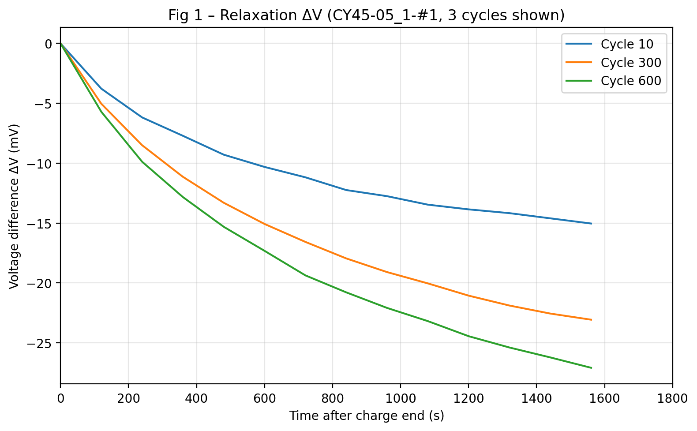

### 画的是什么

从 Dataset 1 中选取一颗循环数 ≥ 600 的电芯，在同一颗电芯上对比 **第 10、300、600 圈** 满充后的弛豫电压变化。

### 坐标轴

| 轴 | 含义 |
|----|------|
| 横轴 | 充电结束后的时间（秒），范围 0–1800 s（30 min） |
| 纵轴 | **ΔV = V(t) − V(t₀)**（mV），即相对弛豫起点的电压差 |

### 怎么读

- 三条曲线对应电池生命早期、中期、晚期。
- 随循环增加，弛豫曲线整体形态会偏移/变缓，反映极化与内阻的衰退。
- 这是 MAE 的**原始输入信号**；后续所有隐变量都从这 30 个（D1/D2）或 60 个（D3）采样点编码而来。

### 数据来源

原始 CSV → `find_post_charge_relaxation()` 定位满充后 `I≈0` 且 `V>4.0 V` 的弛豫段 → 截取并重采样。

---

## Fig 2 — CC 恒流充电时间退化

**文件**：`fig2_cc_time_dataset1.png`、`fig2_cc_time_dataset2.png`

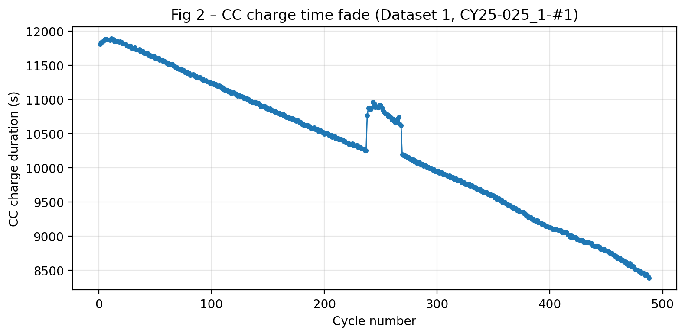

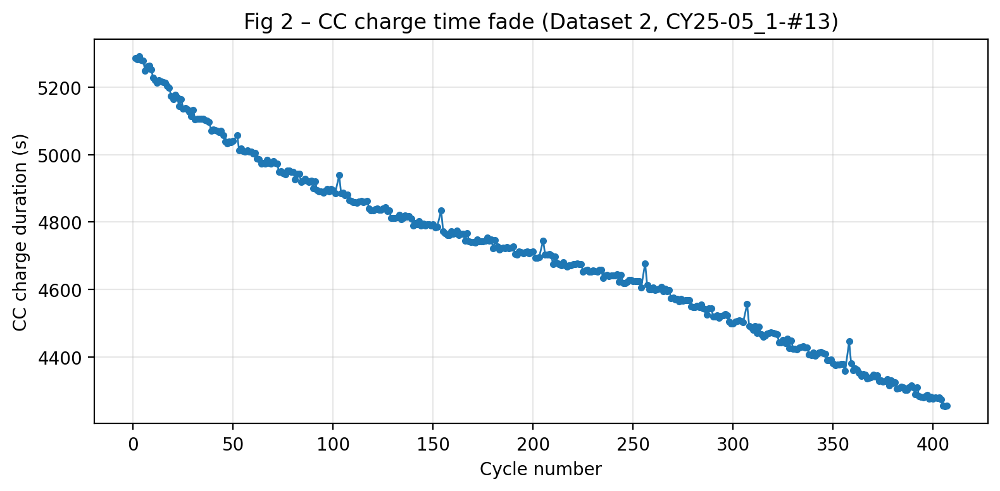

### 画的是什么

单颗代表性电芯上，每一圈**恒流（CC）充电阶段持续时间**随循环圈数的变化。

### 坐标轴

| 轴 | 含义 |
|----|------|
| 横轴 | 循环圈数（Cycle number） |
| 纵轴 | CC 充电时长（秒） |

### 怎么读

- CC 时间随容量衰减通常会**变长**（同样 SOC 区间需要更多时间充入）。
- 这是 Fusion 模块的第二路输入；经 `log(CC/CC₀)` 与 z-score 变换后，与弛豫隐向量门控融合。
- D1 为 NCA 电池，D2 为 NCM 电池；两者退化趋势可能不同，故分两张图展示。

### 注意

CC 时间取的是每圈**第一段**恒流充电（非最长段），与论文中 CC 特征定义一致。

---

## Fig 3 — MAE 掩码自编码重构

**文件**：`fig3_mae_recon_dataset1.png`、`fig3_mae_recon_dataset2.png`、`fig3_mae_recon_dataset3.png`

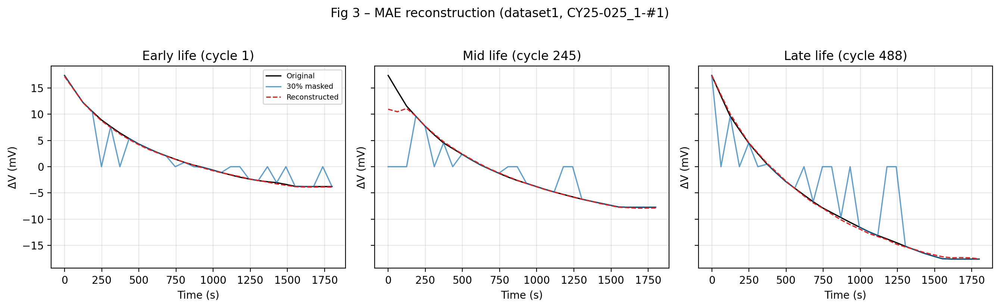

### 画的是什么

对同一电芯在**生命早期 / 中期 / 晚期**三个循环，展示 MAE 的「遮挡 → 重构」能力。每张图含 3 个子图（Early / Mid / Late life）。

### 三条曲线

| 曲线 | 颜色 | 含义 |
|------|------|------|
| Original | 黑色实线 | 完整 ΔV 序列（ground truth） |
| 30% masked | 蓝色 | 随机遮挡 30% 时间点后送入编码器的输入 |
| Reconstructed | 红色虚线 | 解码器从隐向量 z 还原的完整序列 |

### 坐标轴

| 轴 | 含义 |
|----|------|
| 横轴 | 弛豫时间（秒），D1/D2 为 0–1800 s，D3 为 0–3600 s |
| 纵轴 | ΔV（mV） |

### 怎么读

- 重构曲线与原始曲线越贴合，说明 MAE 越能压缩弛豫曲线的本质信息。
- 晚期循环若仍能较好重构，说明隐向量 z 捕获了与老化相关的弛豫形态变化。
- D1/D2 使用 `mae_short`（30 点），D3 使用 `mae_long`（60 点）。

---

## Fig 4 — 隐向量流形（t-SNE）

**文件**：`fig4_latent_manifold_single_cell.png`、`fig4_latent_manifold_all.png`

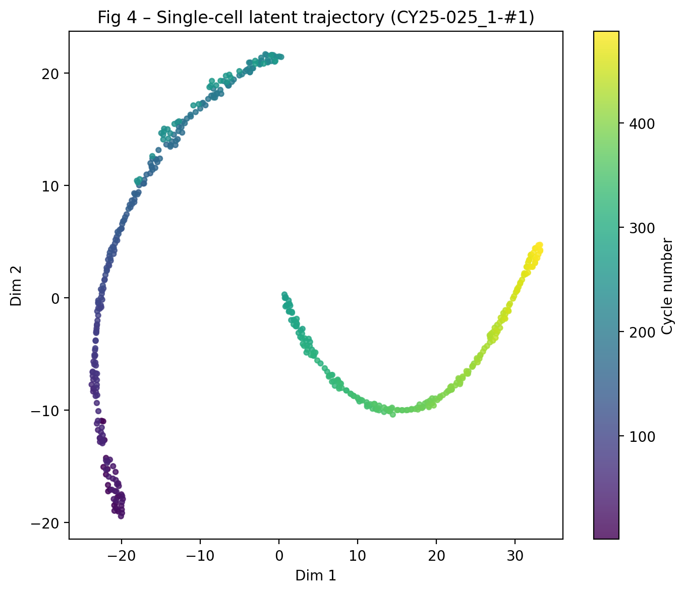

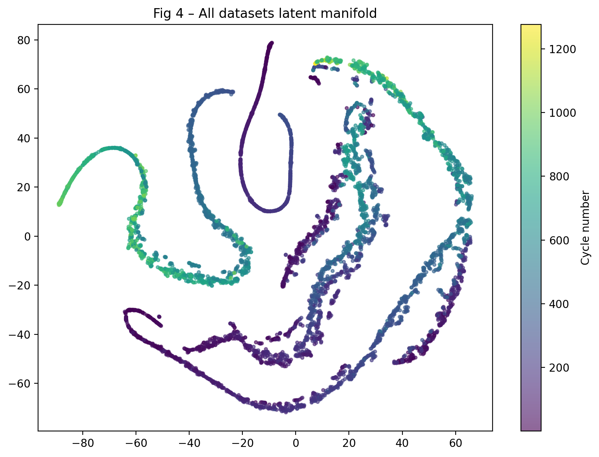

### 画的是什么

将 MAE 编码器输出的 **32 维隐向量 z** 降维到 2D（t-SNE），用颜色表示循环圈数。

### 左图：单电芯老化轨迹

- 仅 Dataset 1 的一颗长循环电芯。
- 每个点 = 该电芯某一圈的 z。
- **期望**：颜色从浅到深（低圈→高圈）形成连续轨迹，说明 z 随老化单调演变。

### 右图：全数据集流形

- 合并 D1 + D2 + D3，每集最多抽 2000 点。
- 展示不同材料、不同电芯的 z 在隐空间中的整体分布。
- 颜色仍表示循环圈数；可观察不同数据集是否共享相似的老化方向。

### 坐标轴

| 轴 | 含义 |
|----|------|
| Dim 1 / Dim 2 | t-SNE 嵌入坐标（无物理单位，仅表相对距离） |
| 颜色条 | 循环圈数 |

---

## Fig 5 — 门控融合权重

**文件**：`fig5_attention_weights.png`、`fig5_attention_by_condition.png`

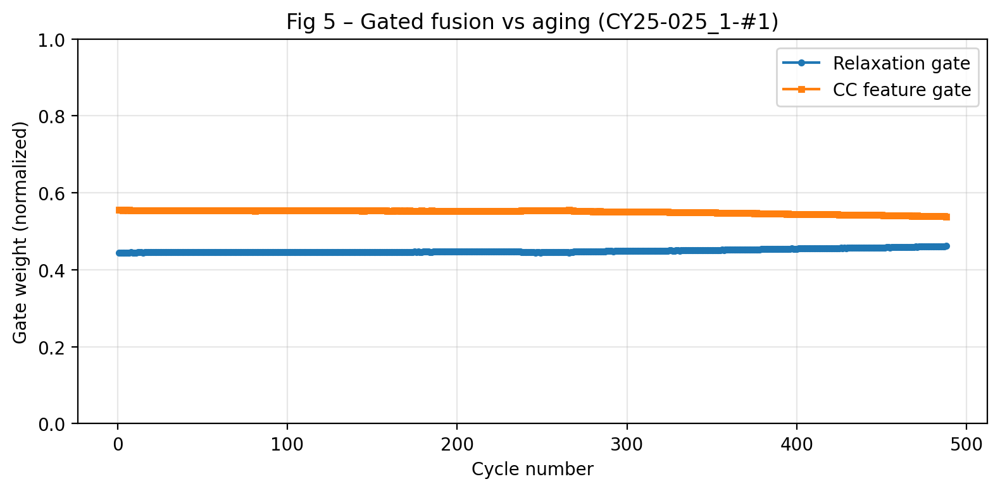

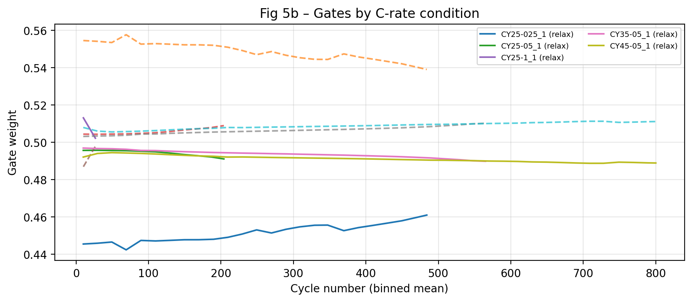

### 画的是什么

Fusion 模块对两路特征的**归一化门控权重**：

1. **Relaxation gate** — 弛豫 MAE 隐向量这一路
2. **CC feature gate** — CC 充电时间特征这一路

两路权重经 Sigmoid 门控后归一化（和为 1），不是 Softmax，避免某一路被完全压到 0。

### 左图：单电芯随老化变化

| 轴 | 含义 |
|----|------|
| 横轴 | 循环圈数 |
| 纵轴 | 门控权重（0–1） |

**怎么读**：若 CC 权重随循环上升，说明模型更依赖 CC 时间判断容量；若弛豫权重主导，则隐向量 z 是主要信号。

### 右图：按 C-rate 工况分组

- Dataset 1 全部样本，按电芯工况（如 CY25-05_1、CY45-05_1）分组。
- 每 20 圈取平均，实线为弛豫门控，虚线为 CC 门控。
- **怎么读**：不同充放电倍率下，模型对两路信息的依赖比例可能不同。

---

## Fig 6 — 容量预测散点图

**文件**：`fig6_capacity_prediction.png`

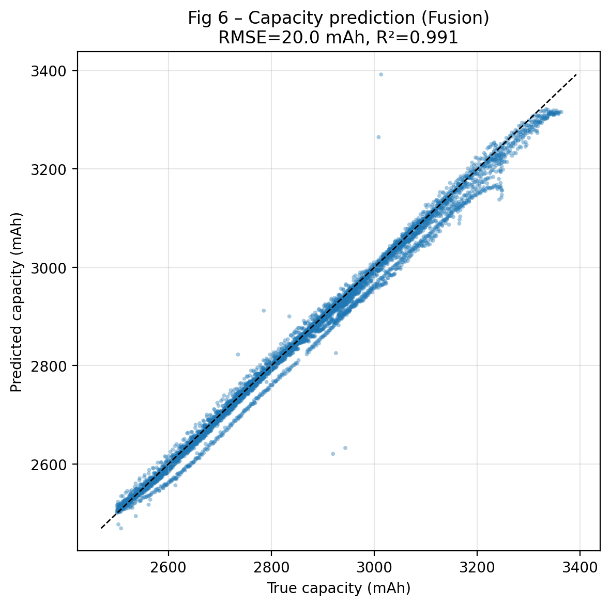

### 画的是什么

Dataset 1 上 **Strategy D 测试集**（留出电芯）的容量预测结果：Fusion 集成模型（3 seeds）vs 真实放电容量。

### 坐标轴

| 轴 | 含义 |
|----|------|
| 横轴 | 真实放电容量（mAh） |
| 纵轴 | 模型预测容量（mAh） |
| 黑色虚线 | y = x 理想预测线 |

### 怎么读

- 点越贴近对角线，预测越准。
- 标题中标注 **RMSE（mAh）** 与 **R²**。
- 当前典型结果：测试 RMSE ≈ **0.57%**（归一化），R² ≈ 0.99。

### 评估设置

- 按电芯划分 train/test（同一电芯不会同时出现在训练和测试）。
- 与论文 Strategy D 一致。

---

## Fig 7 — 跨数据集泛化对比

**文件**：`fig7_transfer_comparison.png`

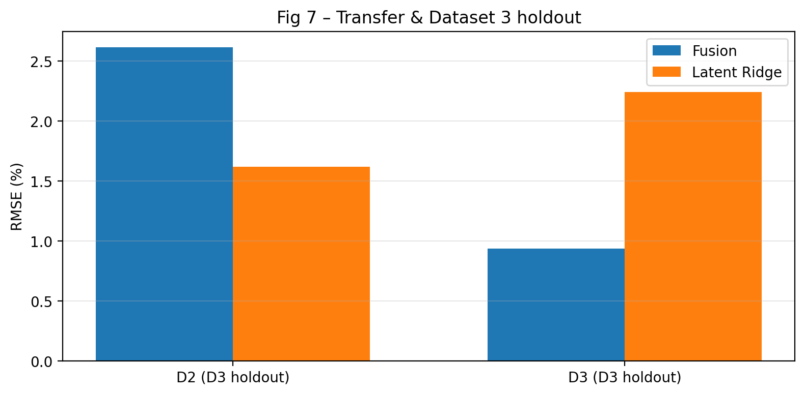

### 画的是什么

柱状图对比 **Fusion 模型** 与 **Latent Ridge 基线** 在跨域场景下的 RMSE（%）。

| 分组 | Fusion 柱 | Latent Ridge 柱 |
|------|-------------|-----------------|
| D2 | D1 训练的 Fusion 经 D2 TL 微调后的误差 | D1 模型零样本直接用于 D2 的 Ridge 基线 |
| D3 | 在 D3 上原生训练 Fusion 的留出评估 | 同场景下仅用隐向量 + Ridge 回归 |

### 坐标轴

| 轴 | 含义 |
|----|------|
| 横轴 | 数据集与评估模式 |
| 纵轴 | RMSE（%），基于归一化容量 |

### 怎么读

- 柱越低越好。
- Fusion 通常显著优于单纯 Latent Ridge，说明 CC 门控融合有增益。
- D2 考察 NCA→NCM 跨材料迁移；D3 考察 NCM+NCA 混合电池上的原生性能。

---

## 训练曲线

### 总览 — `train_overview_val_loss.png`

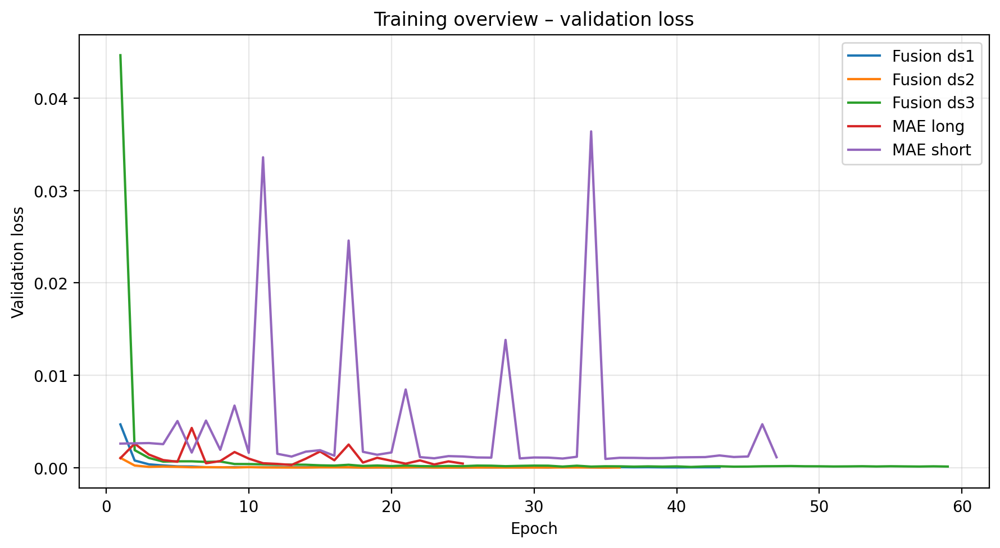

所有 MAE 与 Fusion 子模型的**验证集 loss** 随 epoch 变化，一张图对比收敛速度与最终水平。

| 曲线名 | 含义 |
|--------|------|
| MAE short | 30 点序列 MAE（服务 D1/D2） |
| MAE long | 60 点序列 MAE（服务 D3） |
| Fusion ds1/2/3 | 各数据集上的门控融合 + 容量头 |

---

### MAE 训练 — `train_mae_short.png`、`train_mae_long.png`

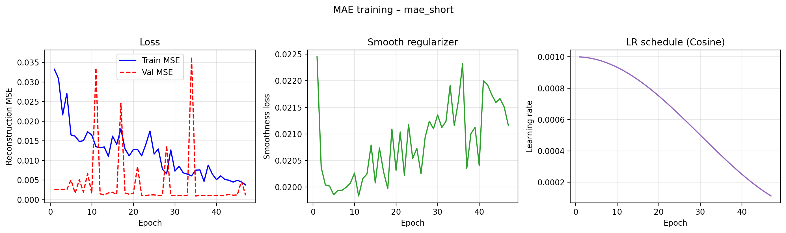

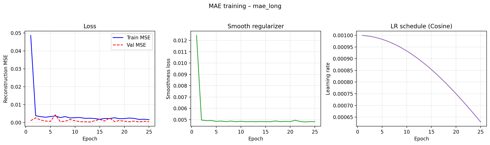

三列子图：

| 子图 | 含义 |
|------|------|
| Loss | 训练 / 验证重构 MSE；验证 loss 不再下降即触发早停 |
| Smooth regularizer | 解码序列平滑正则项，抑制重构曲线抖动 |
| LR schedule | 余弦退火学习率 |

- **short**：seq_len=30，用于 Dataset 1/2。
- **long**：seq_len=60，用于 Dataset 3。

---

### Fusion 训练 — `train_fusion_ds1.png`、`train_fusion_ds2.png`、`train_fusion_ds3.png`

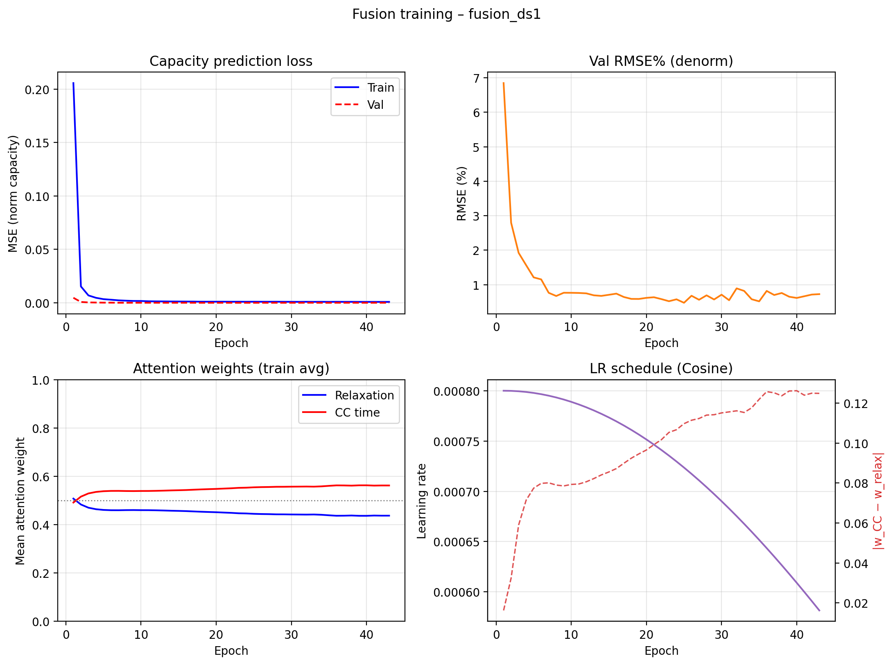

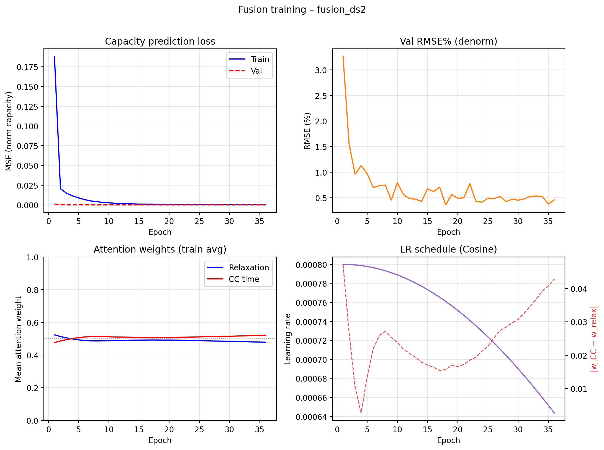

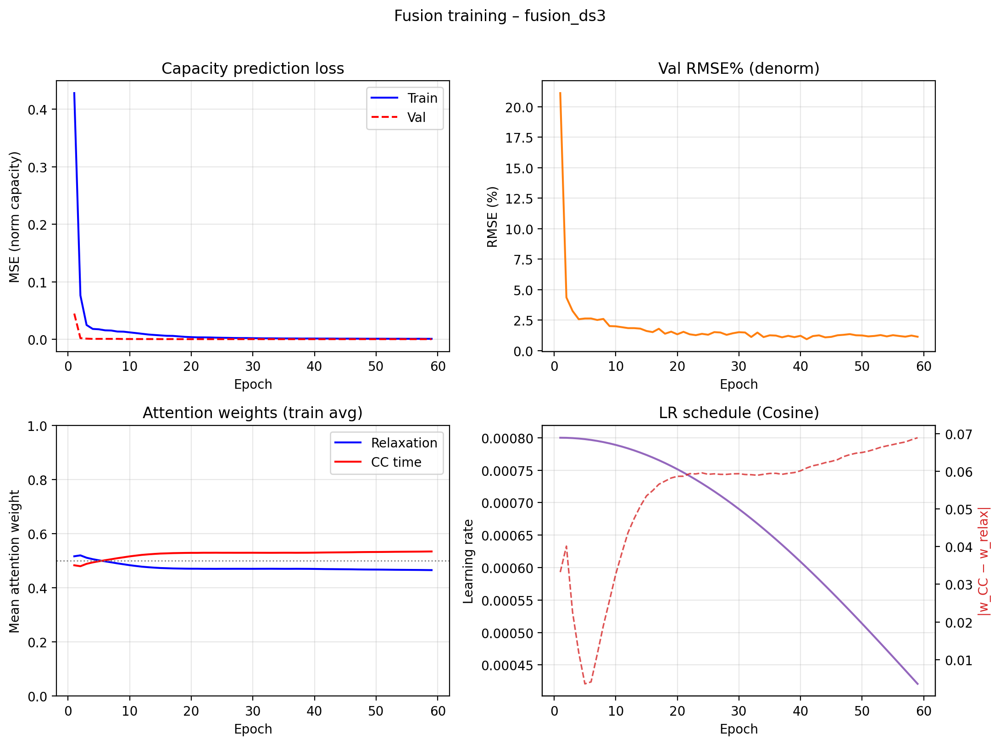

2×2 四宫格：

| 子图 | 含义 |
|------|------|
| Capacity prediction loss | 归一化容量的训练 / 验证 MSE |
| Val RMSE% | 反归一化后的验证 RMSE（百分比），直观反映容量误差 |
| Attention weights (train avg) | 训练集上两路门控权重的 epoch 均值；虚线 0.5 为均衡参考 |
| Attention regularizers | 熵正则与均衡惩罚（若训练中有记录） |
| LR schedule / gate gap | 余弦学习率 + 两路门控权重差 \|w_CC − w_relax\|（默认显示） |

- **ds1**：在 D1 上训练，用于主结果与 D2 迁移源模型。
- **ds2**：在 D2 上原生训练，用于 D2 留出评估（RMSE ≈ 0.36%）。
- **ds3**：在 D3 上原生训练（需 `mae_long`），用于 D3 留出评估。

---

## 图表与代码对应关系

| 文件 | 生成函数 | 源文件 |
|------|----------|--------|
| `fig1_relaxation_delta_v.png` | `fig1_relaxation_delta_v()` | `figures.py` |
| `fig2_cc_time_dataset*.png` | `fig2_cc_charge_time()` | `figures.py` |
| `fig3_mae_recon_*.png` | `fig3_mae_reconstruction()` | `figures.py` |
| `fig4_latent_manifold_*.png` | `fig4_latent_manifold()` | `figures.py` |
| `fig5_attention_*.png` | `fig5_attention_weights()` 等 | `figures.py` |
| `fig6_capacity_prediction.png` | `fig6_capacity_prediction()` | `figures.py` |
| `fig7_transfer_comparison.png` | `fig7_transfer_comparison()` | `figures.py` |
| `train_*.png` | `plot_mae_history()` / `plot_fusion_history()` | `plot_training.py` |
| `train_overview_val_loss.png` | `plot_training_overview()` | `plot_training.py` |

重新生成全部图表：

```bash
python research_mae/run_all.py --skip-train --device cpu
```

（需已有 checkpoint；完整训练后也会自动出图。）

---

## 相关文档

- [README.md](./README.md) — 快速上手与结果摘要
- [IMPLEMENTATION.md](./IMPLEMENTATION.md) — 实现细节与 Debug 记录
- [PAPER_METHODS_RESULTS.md](./PAPER_METHODS_RESULTS.md) — 论文方法对照与实验设置
